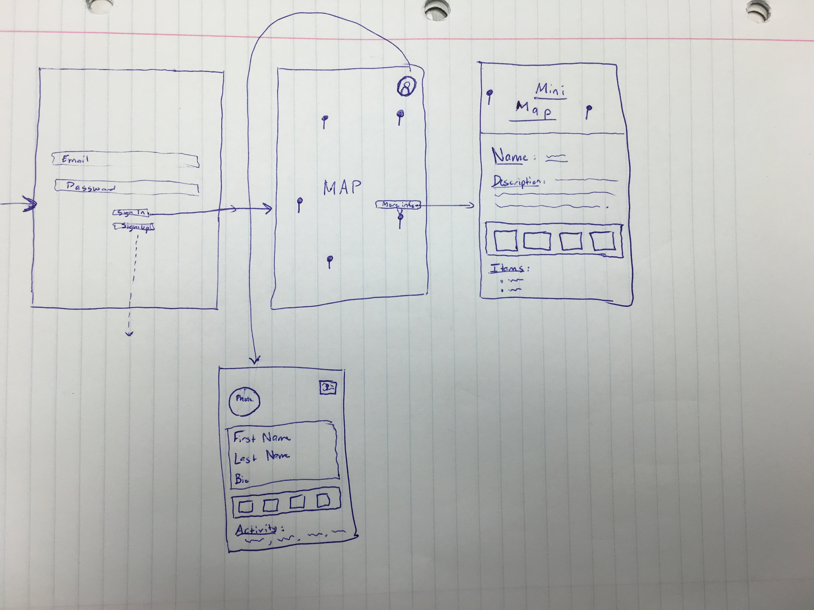
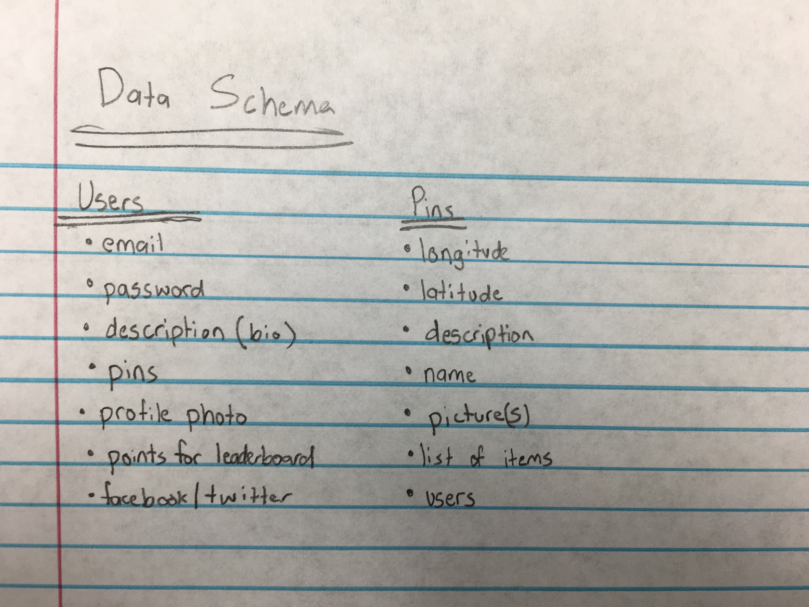

# Homie
This is the final project for CodePath University.

## Description

AppName is an app that allows communities to assist the homeless/underpriviliged people around them by supplying them with food, welness items, or basic neccessities at their location.

Users of the app will drop a pin at their location when they see someone who needs help. Other users can view these pins, go to those locations, and help the people there.

### Required stories
- User is able to sign in using email/facebook/twitter.
- User can view all pins placed by other users in a map view.
- Users can tap on pin to view description, name, items, etc..
- User is able to add a pin and provide pic, location (could use current location), and description.

### Nice to have:
- 3D touch to preview pins before opening detailed page.
- We want to make this app really polished so we will be using custom animations and segues.
- Moderator screen to approve submitted pins
- City based leaderboard
- Sharing recent activity to facebook and twitter

## Wireframing:

## Data Schema:

## License

    Copyright (c) 2016 MJA-CodePath

    Permission is hereby granted, free of charge, to any person obtaining a copy
    of this software and associated documentation files (the "Software"), to deal
    in the Software without restriction, including without limitation the rights
    to use, copy, modify, merge, publish, distribute, sublicense, and/or sell
    copies of the Software, and to permit persons to whom the Software is
    furnished to do so, subject to the following conditions:

    The above copyright notice and this permission notice shall be included in all
    copies or substantial portions of the Software.

    THE SOFTWARE IS PROVIDED "AS IS", WITHOUT WARRANTY OF ANY KIND, EXPRESS OR
    IMPLIED, INCLUDING BUT NOT LIMITED TO THE WARRANTIES OF MERCHANTABILITY,
    FITNESS FOR A PARTICULAR PURPOSE AND NONINFRINGEMENT. IN NO EVENT SHALL THE
    AUTHORS OR COPYRIGHT HOLDERS BE LIABLE FOR ANY CLAIM, DAMAGES OR OTHER
    LIABILITY, WHETHER IN AN ACTION OF CONTRACT, TORT OR OTHERWISE, ARISING FROM,
    OUT OF OR IN CONNECTION WITH THE SOFTWARE OR THE USE OR OTHER DEALINGS IN THE
    SOFTWARE.
